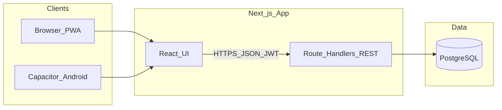

# High Level Design (HLD)

POS / billing web application: multi-business SaaS-style shell with PostgreSQL backend, Next.js App Router, and optional Capacitor for mobile packaging.

## Diagrams (Draw.io / diagrams.net)

Editable diagrams live in **[`diagrams/pos-hld-lld.drawio`](./diagrams/pos-hld-lld.drawio)** (multi-page). Open in [diagrams.net](https://app.diagrams.net/) (File → Open from → Device) or use the **Draw.io Integration** extension in VS Code.

| Page | Content |
|------|---------|
| **HLD - System context** | Clients → Next.js → PostgreSQL |
| **LLD - Layered architecture** | App → Application → Infrastructure → Shared (+ client state, DB) |
| **LLD - POS checkout (sequence)** | POS UI → API → service → DB (simplified) |

The sections below mirror that content in Markdown + Mermaid for version control and diffs.

## 1. System context

- **Users**: staff authenticate (email/password); JWT identifies the user for API calls.
- **Tenancy**: operations are scoped by **business**; membership is checked per request (`assertBusinessMembership` / infrastructure auth).
- **Modules**: features (billing, inventory, tables, kitchen, etc.) are toggled per business profile (`enabled_modules`).

## 2. Major logical components

| Component | Role |
|-----------|------|
| **Web UI** | Next.js pages under `src/app/(app)/`: dashboard, POS, products/catalog, inventory, purchases, reports, settings, optional modules (appointments, kitchen, tables, staff, …). |
| **Auth UI** | `src/app/(auth)/`: login, register, forgot password. |
| **REST API** | `src/app/api/**/route.ts`: thin HTTP adapters; validate input (Zod), authorize, delegate to services or SQL. |
| **Application services** | `src/application/`: use cases (checkout, dashboard metrics, purchases, tab orders, advanced reports, …). |
| **Infrastructure** | `src/infrastructure/`: DB pool, JWT/session helpers, business membership, HTTP error mapping for routes. |
| **Client state** | Zustand stores (`auth`, `business`, `cart`, `pos-session`, `pos-held-sales`, `ui`, …) + TanStack Query for server data. |
| **Database** | PostgreSQL; schema in `db/schema.sql`, incremental changes in `db/migrations/`. |

## 3. Deployment view (typical)

- **Runtime**: Node.js hosting the Next.js server (or serverless equivalent for API routes).
- **Database**: managed PostgreSQL reachable from the app via `DATABASE_URL` (see `src/config/env.ts` / infrastructure pool).
- **Mobile**: Capacitor wraps the web app; API base URL configured for device/network (see `docs/capacitor.md` if present).

## 4. Security boundaries

- **Authentication**: JWT issued at login/register; stored client-side for `Authorization` / cookie strategy as implemented.
- **Authorization**: every mutating and most read APIs require a valid user and **business membership** for the `businessId` in query/body.
- **Errors**: database and validation errors are mapped to HTTP status codes without leaking raw PostgreSQL details to clients (see `src/infrastructure/http/route-errors.ts`).

## 5. Feature modules (business capability)

Navigation and route access are driven by **enabled modules** (see `src/shared/navigation/nav-modules.ts`, `src/shared/domain/business-modules.ts`):

- Core: **billing** (POS), **products** / **menu** / **services** (catalog).
- Optional: **inventory**, **purchases**, **customers**, **tables**, **kitchen**, **appointments**, **staff**, **reports**, **recipes**, etc.

## 6. Integrations (conceptual)

- **POS checkout**: creates orders and payments in DB; may trigger kitchen / KOT flows when enabled.
- **Offline** (where implemented): client-side queue/sync bridges (`src/lib/offline/`) — not a separate server.

## 7. Relationship to LLD

- **HLD** (this document): *what* the system is and *how* major pieces interact.
- **LLD** (`LLD.md`): *how* layers, APIs, stores, and key flows are structured in code.

For coding standards and layer rules, see [`ARCHITECTURE.md`](./ARCHITECTURE.md).
