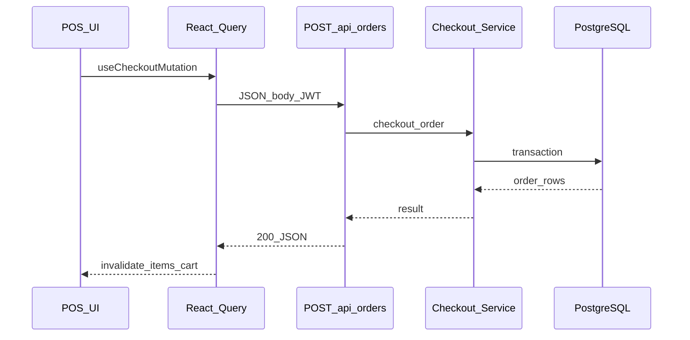

# Low Level Design (LLD)

Detailed structure of the Next.js POS / billing codebase: directories, API surface, client state, and representative flows.

## Diagrams (Draw.io / diagrams.net)

Editable diagrams are in **[`diagrams/pos-hld-lld.drawio`](./diagrams/pos-hld-lld.drawio)**. Use the **LLD - Layered architecture** and **LLD - POS checkout (sequence)** pages for visuals; keep this document as the textual LLD spec.

## 1. Layered architecture (dependency rules)

| Layer | Path | May import | Must not import |
|-------|------|------------|-----------------|
| **App** | `src/app/` | `application`, `infrastructure`, `shared`, `hooks`, `stores`, `components` | — |
| **Application** | `src/application/` | `infrastructure`, `shared` | `next/*`, `react` (keep use-cases server-pure) |
| **Infrastructure** | `src/infrastructure/` | `config`, DB/auth libs | `application` (avoid cycles) |
| **Shared** | `src/shared/` | — | `infrastructure` (keeps client bundles clean) |

Legacy `@/lib/*` re-exports exist; new code should prefer `@/shared/*`, `@/application/*`, `@/infrastructure/*` (see [`ARCHITECTURE.md`](./ARCHITECTURE.md)).

## 2. App Router layout

| Area | Path | Notes |
|------|------|--------|
| Root layout | `src/app/layout.tsx` | Global styles, providers. |
| Auth segment | `src/app/(auth)/` | Login, register, forgot password; layout without main app chrome. |
| App segment | `src/app/(app)/` | Authenticated shell: `layout.tsx`, bottom nav, pages per feature. |
| API | `src/app/api/**/route.ts` | REST handlers; `GET`/`POST`/`PATCH`/`DELETE` as per resource. |

Dynamic routes follow Next.js conventions: e.g. `items/[id]/route.ts`, `orders/[id]/complete/route.ts`.

## 3. REST API inventory (representative)

| Domain | Routes (pattern) | Purpose |
|--------|------------------|---------|
| Auth | `/api/auth/login`, `/register`, `/me` | Session / user identity. |
| Business | `/api/business`, `/api/business/[id]` | Businesses CRUD / settings / modules. |
| Catalog | `/api/items`, `/api/items/[id]`, `/api/categories` | Items, categories. |
| Orders | `/api/orders`, `/api/orders/[id]`, `/api/orders/open`, `/api/orders/[id]/complete`, `/api/orders/[id]/kitchen` | Checkout, open orders, table/kitchen updates. |
| Payments | `/api/payments`, `/api/payments/[id]` | Payment lines. |
| Customers | `/api/customers`, `/api/customers/[id]`, `.../loyalty` | CRM / loyalty. |
| Inventory | `/api/inventory`, `/api/inventory/transactions` | Stock levels and movements. |
| Purchases | `/api/purchases`, `/api/purchases/[id]/payments`, `/api/suppliers` | Stock-in. |
| Ops | `/api/staff`, `/api/tables`, `/api/tables/[id]`, `/api/kot`, `/api/kot/[id]`, `/api/appointments`, `/api/appointments/[id]` | Staff, tables, kitchen tickets, bookings. |
| Reporting | `/api/dashboard`, `/api/reports`, `/api/reports/advanced` | KPIs and analytics. |
| Health | `/api/health/db` | DB connectivity check. |

**Handler pattern**: `requireUser` → `assertBusinessMembership` → parse JSON + Zod schema → service or `pool.query` → `jsonOk` / `handleRouteError`.

## 4. Application services (use cases)

Located under `src/application/` (examples):

- **Orders**: `checkout-order.service.ts`, `tab-order.service.ts`, `post-checkout-effects.ts`.
- **Dashboard**: `dashboard-metrics.service.ts`.
- **Purchases**: `record-purchase.service.ts`.
- **Reports**: `advanced-reports.service.ts`.

These encapsulate transactions, tax/discount rules, and multi-table updates; route handlers stay thin.

## 5. Client: data fetching and state

### 5.1 TanStack Query (`src/hooks/queries.ts`)

- Centralized `queryKey` conventions: `["items", businessId, …]`, `["businesses"]`, etc.
- `apiFetch` from shared API client attaches JWT, parses errors into `ApiError`.

### 5.2 Zustand stores (`src/stores/`)

| Store | Responsibility |
|-------|----------------|
| `auth-store` | Token / user session for API calls. |
| `business-store` | Current business id and business list. |
| `cart-store` | POS lines, order-level discount; `cartSubtotal` helpers. |
| `pos-session-store` | Category filter, selected customer, payment method, table id. |
| `pos-held-sales-store` | Walk-in **held sale** queue (snapshots + optional `localStorage` per business). |
| `ui-store` | Modal keys (e.g. customer picker). |

### 5.3 Key UI surfaces

- **POS** (`src/app/(app)/pos/page.tsx`): product grid, sticky cart (collapsible on small viewports), checkout modal, held-queue modal.
- **Products** (`src/app/(app)/products/page.tsx`): category sections, kind tabs, chips (e.g. link to POS, add menu item modal).
- **Product detail** (`src/app/(app)/products/[id]/page.tsx`): item edit form, `PATCH /api/items/[id]`.

## 6. Data model (conceptual)

- **Multi-tenant**: most tables include `business_id` (see `db/schema.sql`).
- **Items**: `kind` ∈ `product`, `service`, `menu_item`, `recipe_component`; optional `image_url`, `category_id`, tax, inventory flags.
- **Orders**: header + line items + payments; statuses for kitchen/table flows where enabled.

## 7. Error handling (LLD)

| Stage | Behavior |
|-------|----------|
| Zod validation | 422 + `issues` payload where configured. |
| `HttpError` | Status + `code` from `shared/kernel/http`. |
| PostgreSQL | `map-pg-error` / `route-errors`: map to 409/404/400/500 without exposing `detail` to client. |
| Client | `ApiError` with `status`, `code`, `message`; `status === 0` for network failures. |

## 8. Representative sequence: POS checkout

## 9. Held sale queue (walk-in POS)

- **Not** persisted on server in v1; client store + optional `localStorage` key `pos-held-sales:{businessId}`.
- **Hold**: snapshot cart + discount + customer → clear cart.
- **Resume**: restore into `cart-store` / `pos-session-store` when active cart is empty (v1 rule).

## 10. Configuration

- **Server**: `src/config/env.ts` — database URL, JWT secret, etc.; must not be imported from client components.
- **Capacitor**: `capacitor.config.ts` — native shell / server URL for mobile builds.

## 11. Testing and operations (pointers)

- DB migrations: `db/migrations/` applied in order on existing databases; `db/README.md` for operations.
- Scripts: `scripts/` for seeding, import, setup — run in CI or local dev as documented per script.

---

For folder tree and module toggles, see [`PROJECT_STRUCTURE.md`](./PROJECT_STRUCTURE.md). For layer philosophy, see [`ARCHITECTURE.md`](./ARCHITECTURE.md).
